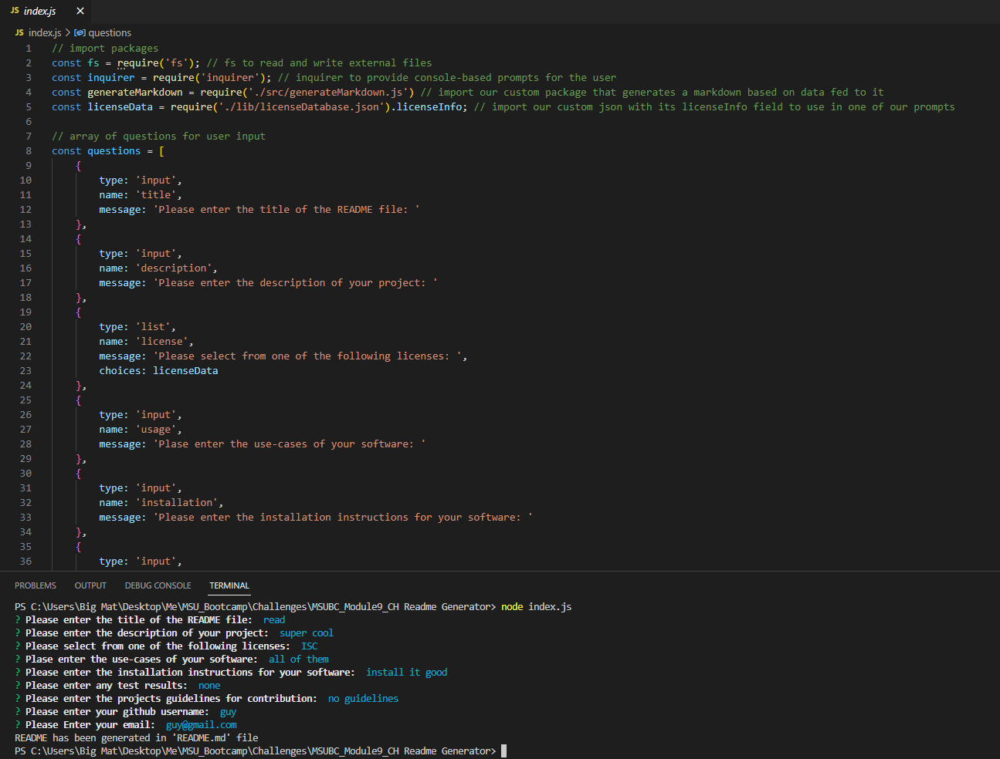

  # MSUBC_Module9_CH Readme Generator by Mateusz Zielinski
  Module Topic: NodeJS
  ## Description
  This program generates a standardized README.md file based on user-inputted data
  
  
  ## License
  
  This application is not currently under any license agreement.
  ## Table of Contents
  - [License](#License)
  - [Usage](#Usage)
  - [Installation](#Installation)
  - [Testing](#Testing)
  - [Contributing](#Contributing)
  - [Video](#Video)
  ## Usage
  - open the project in vscode or another compatible editor
  - right click on 'index.js' and select 'open in integrated terminal'
  - in the command line type in 'node index.js' - answer all of the prompts 
  - once all prompts have been answered, the generated README should show up in the 'dist' folder
  ## Installation
  - open gitbash
  - navigate to the desired parent folder 
  - type into gitbash 'git clone https://github.com/IMadeThisJustToPostThis/MSUBC_Module9_CH-Readme-Generator.git'
  ## Testing
  no tests, simply bug tested manually
  ## Contributing
  contibute however you want i don't care
  ## Questions
  Github:<https://github.com/IMadeThisJustToPostThis>
  
  Email: zielinm2@mail.lcc.edu
  ## Video
  click on the image below to view the video
  
  